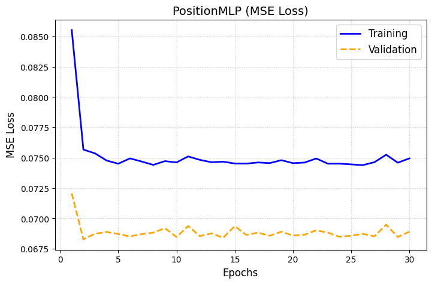
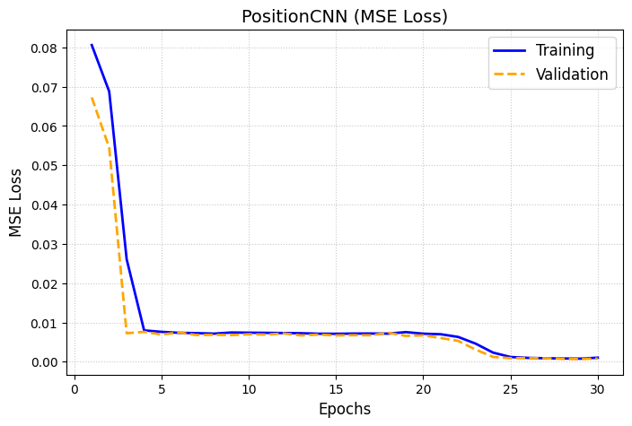
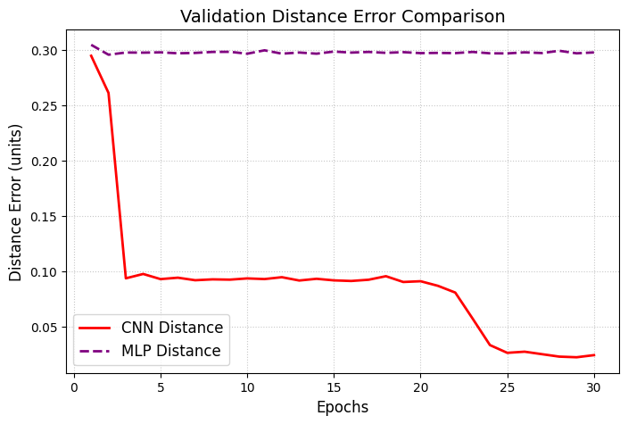
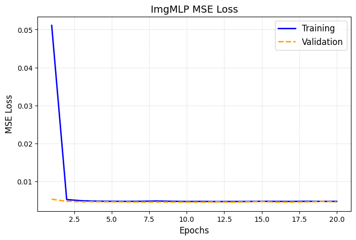
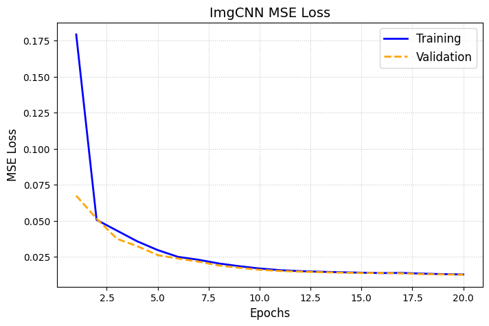
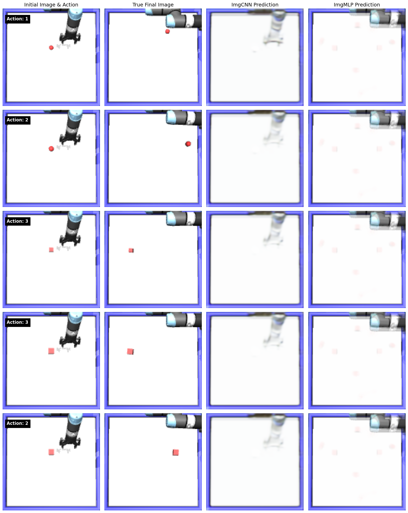

# CmpE591-Homework 1

## File Structure

```bash
.
├── dataset/                    # Directory containing all generated training and testing .pt data
├── figures/                    
├── models/                     # Directory containing the weights of the models
├── cmpe591_hw1.ipynb           # Jupyter Notebook containing everything 
├── environment.py              # Provided script
├── homework1.py                # Provided script
├── img_both.py                 # Image Generation models (ImgMLP & ImgCNN. I wanted to test both.)
├── pos_CNN.py                  # Position Prediction CNN
├── pos_MLP.py                  # Position Prediction MLP
└── README.md                   
```

The dataset consists of a 1000-sample training set (I divided that as 800 training and 200 validation) and a 200-sample test set.

_NOTE: I collected the data directly modifying and running `homework1.py`._

---

## 1. Position Prediction

### Test Errors

Although I trained the two methods using MSE, I think that comparing their test performances using a more intuitive method helps us understand their difference more clearly. So, I decided on calculating the average distance error. As we can see from the below table and figure, there is a drastic difference in physical distance error between the two architectures.

| Model | Test Distance Error (units) |
| :--- | :--- |
| **PositionMLP** | 0.3071 |
| **PositionCNN** | 0.0273 |

### Loss Curves & Distance Error Comparison

**PositionMLP MSE Loss:**



**PositionCNN MSE Loss:**



**Validation Distance Error Comparison:**


---

## 2. Image Generation

### Test Errors
Although using one of the architectures for this task is enough, I wanted to see their comparative performances. MLP performed better for this task with the arhitectures in `img_both.py`.

| Model | Final Test MSE |
| :--- | :--- |
| **ImgMLP** | 0.00443 |
| **ImgCNN** | 0.01260 |

### Loss Curves

**ImgMLP MSE Loss:**



**ImgCNN MSE Loss:**



### Reconstructed vs. Ground Truth Images
The following figure demonstrates an interesting behavior. Both methods found a safe spot for them and tries to minimize the error rather than actually generating/predicting the final image. For CNN, the object might pose too small importance to avoid the MSE spatial penalty. So, it erases the object and nearly the robot arm. On the other hand, MLP uses another strategy to minimize MSE: It predicts faint objects at all four possible target locations. 


